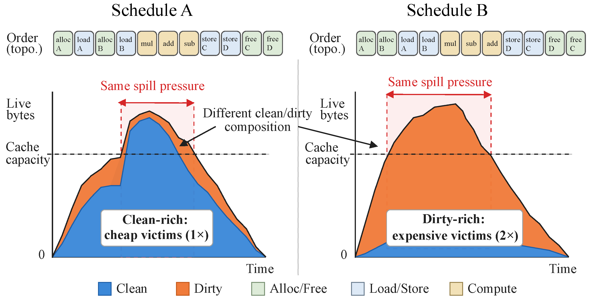
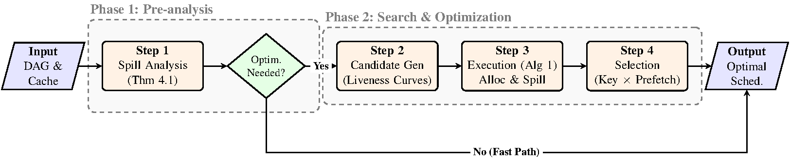
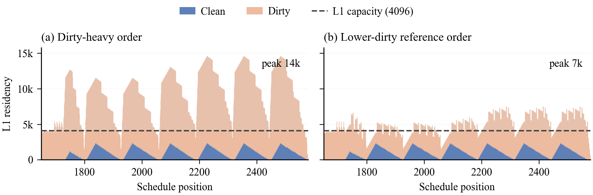
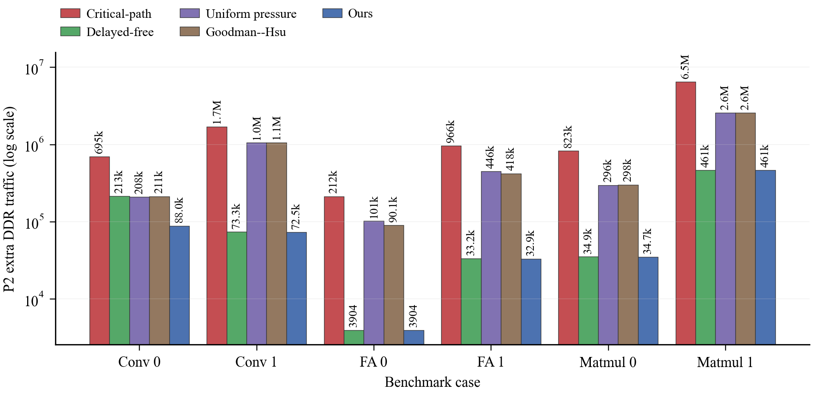
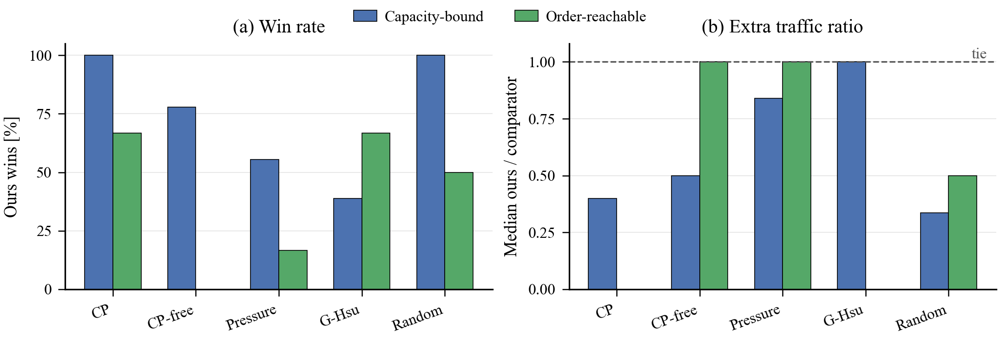

# Spill-Cost-Aware Liveness Shaping for NPU Intra-Kernel Scheduling

<div align="center">

[](https://vennintelligence.github.io/2025A-kernel-sched/)
[](paper/dist/en_conf.pdf)
[](https://www.python.org/)
[]()

Chengzhi Gao ([contact@vennai.org](mailto:contact@vennai.org)) · Jun Huang ([hj992881627@outlook.com](mailto:hj992881627@outlook.com)) · Qin Ye ([yq020319@163.com](mailto:yq020319@163.com))

Southeast University · Venn Intelligence Foundation

</div>

---



Two legal schedules can have similar capacity pressure yet expose very
different clean/dirty compositions to eviction. Keeping clean buffers resident in
high-pressure windows provides low-cost eviction reserve and cuts off-chip traffic.

🌐 **[Project Website](https://vennintelligence.github.io/2025A-kernel-sched/)**

## Abstract

Deep-learning compilers lower neural operators into kernel-level DAGs whose nodes
mix micro-operations, short-lived tensors, and heterogeneous execution pipes.
Under tight on-chip cache capacity, two legal topological orders can have similar
peak pressure yet induce very different off-chip **spill traffic**. This work
identifies a structural asymmetry standard schedulers often miss: **clean**
buffers (loaded from off-chip, already backed) need no write-back when evicted,
whereas **dirty** buffers (produced by computation) must be written back before
reload. The two consume identical on-chip capacity but differ by **2×** in spill
cost. We exploit this with *spill-cost-aware liveness shaping*: pick a legal
schedule order that keeps cheap clean bytes resident as eviction reserve inside
capacity-pressure windows.

## Method



A three-stage pipeline:

1. **Spill diagnosis** — decide whether spills are unavoidable for the given DAG
   and capacity. If so, the goal shifts from *eliminating* spills to *lowering
   their cost*, and overflow area Φ becomes a cheap cross-stage surrogate.
2. **Candidate orders & assignment** — generate three complementary topological
   orders (pressure-aware, capacity-throttled, ID-reserve) and run best-fit
   placement with cost-aware spill insertion along each.
3. **Selection** — pick the best candidate by the true lexicographic key:
   `(E, n, T)` for P2 spill traffic, `(T, E, n)` for P3 runtime. Adding a
   candidate can only improve or tie the chosen objective.

The core claim is that **schedule order, not the victim rule, is the dominant
degree of freedom**: on a fixed order, four Belady-style victim variants differ
by ≤4% in extra traffic, while legal orders can swing it by more than 10×. Three
theory results (spill-inevitability certificate, conditional overflow-area
approximation, Belady-margin stability) delimit exactly the regime where the
method pays off.

## Key results



*Clean/dirty residency decomposition in an L1 high-pressure window. Blue is clean
residency (already has an off-chip copy); orange is dirty residency (requires
write-back); dashed line is L1 capacity. Under the same capacity, different legal
orders expose different peak heights and dirty composition.*

- **2.4–26×** more P2 spill traffic paid by clean/dirty-blind pressure schedulers
  in capacity-bound regimes (median ~11×); pure critical-path orders are 8–54×
  away.
- Across **all 6 cases × 3 views × 4 comparators (72 combinations)**, our order
  is lower or equal in **every** one (same shared best-fit + spill engine).
- **Exactly 2×** clean-vs-dirty gap in a controlled GEMM ablation: clean reserve
  1,536 vs dirty reserve 3,072 units of extra traffic, with structure, peak, and
  spill count held fixed.
- Φ is a cheap, reliable surrogate: **Spearman(Φ, extra) = 0.958**, nearly
  identical to Spearman(peak, extra) = 0.955.
- Applicability tracks the theory: in certificate-flagged capacity-bound regions,
  100% win vs critical-path/random and 77.8% vs the strong free-first companion;
  in order-reachable instances the systematic advantage disappears.
- Runtime: P1 under 0.2 s on every instance; P2/P3 grow with size, reaching
  ~73 s for P3 on the largest (≈36k-node) case.

Evidence spans **four levels**: public NPU benchmarks, synthetic DAG
distributions, small-graph CP-SAT oracles, and controlled ablations.

|  |  |
| :---: | :---: |
| P2 spill traffic vs standard schedulers (log scale, shared engine) | Win rate & median traffic ratio across synthetic regimes |

## Repository layout

| Path | Purpose |
| --- | --- |
| [`src/ks_core/`](src/ks_core/) | Core library: `solver`, `plotting`, `data_utils`, `graph`, `io`, `metrics`, `evaluator`, `constants` |
| [`algorithms/ours/`](algorithms/ours/) | Promoted method — re-exports `ks_core.solver.solve` (final candidate) |
| [`algorithms/baseline/`](algorithms/baseline/) | Reference baseline solver |
| [`autoresearch/`](autoresearch/) | AutoResearch *process* state: iterations, `ledger.csv`, `best_iter.txt` (process, not method) |
| [`experiments/`](experiments/) | YAML-config-driven runner (`run_experiment.py`) + `configs/` |
| [`scripts/paper/`](scripts/paper/) | Paper experiment scripts → regenerate `results/paper/*.csv` (SSOT); `sync_paper_artifacts.py` |
| [`notebooks/`](notebooks/) | Three read-only notebooks (data/problem, paper figures, results report) |
| [`results/paper/`](results/paper/) | Single source of truth: result CSVs + `PAPER_NUMBERS.yml` (regeneratable) |
| [`paper/`](paper/) | LaTeX sources (`src/<target>/`), build (`build.sh`) → `dist/*.pdf`, assets |
| [`web/`](web/) | Single-scroll academic research page (Vite/React) |
| [`data/`](data/) | Benchmark input instances |
| [`docs/`](docs/) | [`RUNNING.md`](docs/RUNNING.md), `problem.md`, `research_summary.md`, standards |
| [`tests/`](tests/) | Unit tests |

## Getting started

See **[docs/RUNNING.md](docs/RUNNING.md)** for the full, copy-pasteable pipeline.
The repo is a `uv` workspace; run everything from the repo root. The essentials:

```bash
make setup            # uv sync --all-extras  (Python 3.12, ks-core editable)
make test             # uv run pytest -v

# Run the canonical baseline experiment
uv run python experiments/run_experiment.py experiments/configs/exp001_baseline01.yaml

# Regenerate paper data (SSOT CSVs), then sync LaTeX/figure artifacts.
# (the full loop over scripts/paper/*.py is in docs/RUNNING.md, stage 2)
uv run python scripts/paper/sync_paper_artifacts.py
```

## Paper

Built PDFs live in [`paper/dist/`](paper/dist/) — four targets, English/Chinese ×
conference/supplement (Chinese is authoritative; the conference instances are
double-blind):

- [`en_conf.pdf`](paper/dist/en_conf.pdf) · [`en_supp.pdf`](paper/dist/en_supp.pdf)
- [`zh_conf.pdf`](paper/dist/zh_conf.pdf) · [`zh_supp.pdf`](paper/dist/zh_supp.pdf)

Build with `bash paper/build.sh all` (requires `latexmk` + `xelatex`).

## Citation

```bibtex
@inproceedings{gao2027liveness,
  title     = {Spill-Cost-Aware Liveness Shaping for NPU Intra-Kernel Scheduling},
  author    = {Gao, Chengzhi and Huang, Jun and Ye, Qin},
  booktitle = {Proc. 2027 IEEE/ACM Int. Symp. on Code Generation and Optimization (CGO)},
  year      = {2027}
}
```
