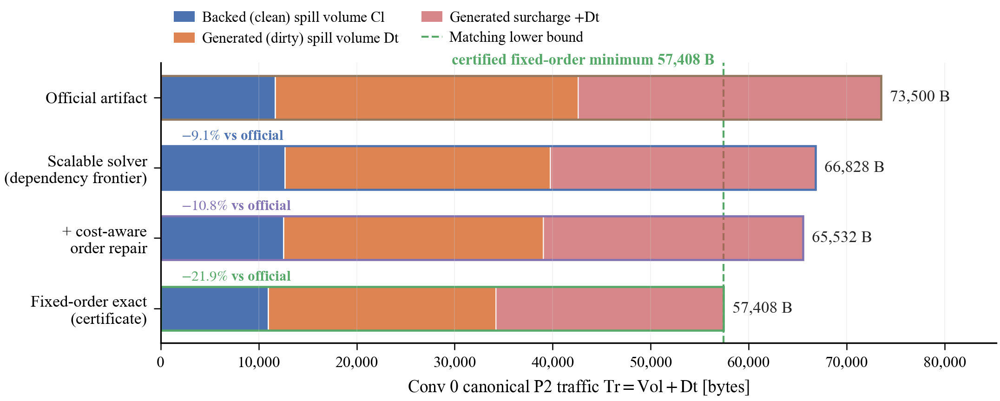
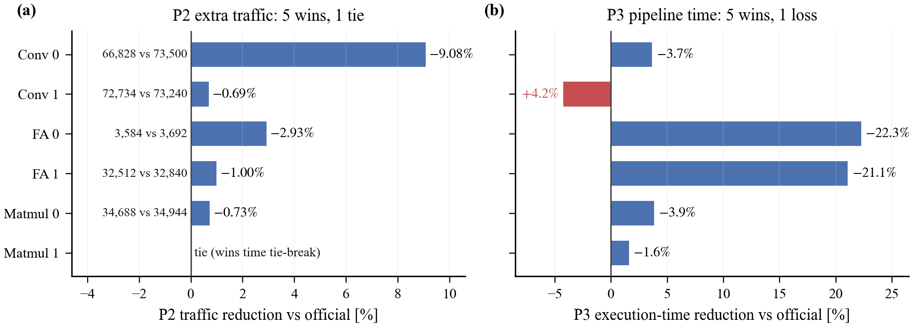
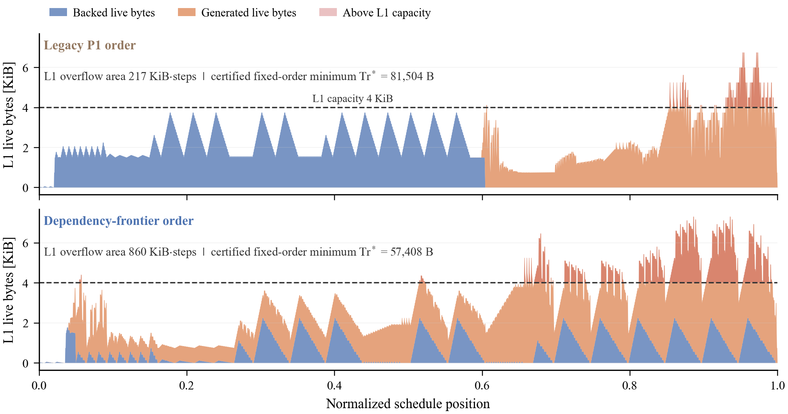

# Dependency-Frontier Scheduling with Asymmetric-Cost Spill Planning for NPU Kernels

<div align="center">

[](https://vennintelligence.github.io/2025A-kernel-sched/)
[](https://www.python.org/)
[](tests/)

Chengzhi Gao ([contact@vennai.org](mailto:contact@vennai.org)) · Jun Huang ([hj992881627@outlook.com](mailto:hj992881627@outlook.com)) · Qin Ye ([yq020319@163.com](mailto:yq020319@163.com))

Southeast University · Venn Intelligence Foundation

[Paper (EN)](paper/dist/en_conf.pdf) · [论文 (ZH)](paper/dist/zh_conf.pdf) · [Supplement](paper/dist/en_supp.pdf) · [Project Website](https://vennintelligence.github.io/2025A-kernel-sched/) · [Results](results/) · [Data](data/)

</div>

<p align="center">
  
</p>

## Abstract

NPU kernel scheduling jointly chooses a legal topological order of a
micro-operation DAG, contiguous on-chip buffer addresses, and a spill plan when
capacity is insufficient. This repository implements a bounded production
portfolio around **dependency-frontier scheduling**, true best-fit placement,
two eviction heuristics, and direct selection by the canonical P2 traffic or P3
time objective.

For a fixed topological order, a weighted residency-gap CP-SAT model supplies a
traffic lower bound. When a separately packed, canonically valid artifact reaches
that bound, it becomes a **fixed-order traffic certificate**. On the six public
DAGs, the production solver records five P2 wins and one tie against the official
artifacts, and five P3 time wins with one loss. The supported conclusion is an
auditable exact-to-heuristic bridge—not a universal clean/dirty composition law.

The six public DAG instances originate from Problem A, “通用神经网络处理器下的
核内调度问题” (intra-kernel scheduling on a general-purpose neural network
processor), of the 2025 “Huawei Cup” 22nd China Graduate Mathematical Contest
in Modeling. The repository preserves the released instances under `data/raw/`;
the paper's internal synthetic suites are separate and are never presented as
additional public contest data.

## Headline results

<p align="center">
  
</p>

All six production artifacts pass the canonical evaluator with zero violations.
Official artifacts are used only for final comparison; no candidate generator
reads an official schedule.

### P2 extra traffic

| Case | Production | Official | Result |
| --- | ---: | ---: | :---: |
| Conv_Case0 | **66,828** | 73,500 | WIN |
| Conv_Case1 | **72,734** | 73,240 | WIN |
| FlashAttention_Case0 | **3,584** | 3,692 | WIN |
| FlashAttention_Case1 | **32,512** | 32,840 | WIN |
| Matmul_Case0 | **34,688** | 34,944 | WIN |
| Matmul_Case1 | **460,800** | **460,800** | TIE |

The maximum P2 reduction is 9.08% and the median reduction is 0.866%. Source:
[`round11_audited_p2.json`](results/autoresearch_v2/round11_audited_p2.json).

### P3 pipeline time

Production is faster on five of six official P3 comparisons, with a median
improvement of 3.77%. Conv_Case1 is the explicit loss: 1,118,687 versus
1,073,322 (+4.23%). P3-selected traffic must not be substituted for the P2
objective. Source:
[`round6_formal_p3.json`](results/autoresearch_v2/round6_formal_p3.json).

## Method and evidence layers

The project keeps three roles separate:

1. **Production portfolio.** Four legal structural orders, true best-fit
   placement, two victim policies, bounded reload windows, and canonical
   objective selection. Dependency frontier is the new structural order.
2. **Offline cost repair.** Nonuniform exploratory studies reduce Conv0 from
   66,828 to 65,532 and Conv1 from 72,734 to 70,940. Different search programs
   and budgets mean these are case studies, not one six-case algorithm.
3. **Fixed-order oracle.** Weighted-gap selection, contiguous packing, artifact
   emission, and canonical validation. It certifies minimum traffic for one
   order only; it does not optimize P2 spill-count/time tie-breaks or search all
   topological orders.

The accounting identity is

```text
Tr = Cl + 2 Dt = Vol + Dt,    Vol = Cl + Dt
```

where `Cl` is backed spill volume and `Dt` is generated spill volume. Every
strict public P2 win reduces `Vol`, but `Dt` does not move uniformly: Conv1 wins
while `Dt` increases, and Matmul0 wins in the `Dt = 0` backed-only regime. No
single class-composition story explains all six cases.

### Bounded research evidence

| Case / fixed order | Result | Status |
| --- | ---: | --- |
| Conv0 / dependency frontier | **57,408** | traffic certificate |
| Conv0 / legacy P1 | **81,504** | traffic certificate |
| FA0 / id_raw | **3,584** | traffic certificate |
| FA1 / capfit_id | 32,512 | feasible; lower bound 31,936 |
| Matmul0 / capfit_id | 34,816 | feasible; lower bound 29,952 |
| Conv1 | — | packing timeout |
| Matmul1 | — | not run |

<p align="center">
  
</p>

**Figure 6. Logical L1 residency on Conv_Case0 under two certified
topological orders.** The dependency-frontier order has a larger geometric
overflow area but a 29.6% lower certified fixed-order traffic optimum (57,408
versus 81,504 bytes).

Changing only the fixed order on Conv0 changes certified optimal traffic from
81,504 to 57,408 bytes (29.6%). The dependency-frontier order nevertheless has
a larger logical L1 overflow area, showing that peak or overflow-area proxies
cannot reliably rank orders under asymmetric spill cost.

## Scope and negative results

- The evaluator uses static `COPY_IN` membership as the backed label; it has no
  explicit buffer read/write roles or dynamic dirty-state transitions.
- `FREE` is a mandatory residency event, and P1 reports logical ALLOC-to-FREE
  footprint rather than physical P2 residency.
- The latest canonical 36-case synthetic re-evaluation supports non-regression,
  not new generalization over the predecessor portfolio.
- All eight 17-node oracle cases match the fixed-order optimum under their own
  selected order; this is small-scale same-order evidence, not global optimality.
- The exact backend remains a research oracle and may time out. Any future
  production integration needs a timeout and a validated heuristic fallback.

## Repository layout

| Path | Purpose |
| --- | --- |
| [`src/ks_core/`](src/ks_core/) | Shared solver, evaluator, graph, metrics, I/O, and plotting code |
| [`algorithms/ours/`](algorithms/ours/) | Public entry point for the production solver |
| [`results/autoresearch_v2/`](results/autoresearch_v2/) | Audits, repair studies, exact evidence, and claim ledgers |
| [`experiments/`](experiments/) | YAML experiment runner and configurations |
| [`paper/`](paper/) | Manuscript sources, tables, figures, and built PDFs |
| [`web/`](web/) | Bilingual project website and interactive contest explainer |
| [`docs/`](docs/) | Running guide, problem description, plotting standards, and research summary |

## Quick start

This is a Python 3.12 `uv` workspace. Run commands from the repository root.

```bash
make setup
make test

# Re-run the public production solver.
uv run python experiments/run_experiment.py experiments/configs/exp001_baseline01.yaml

# Reproduce the audited P2/P3 ledgers.
uv run python scripts/validate_solver_v2.py \
  --problems 2 --output results/autoresearch_v2/round11_audited_p2.json
uv run python scripts/validate_solver_v2.py \
  --problems 3 --output results/autoresearch_v2/round6_formal_p3.json

# Reproduce one fixed-order certificate.
uv run python scripts/agent_direct_search.py \
  --cases Conv_Case0 --exact-order unlock_frontier --time-limit 30 \
  --out results/autoresearch_v2/agent_direct
```

See [`docs/RUNNING.md`](docs/RUNNING.md) for output ownership and exact
reproduction commands. The consolidated evidence narrative is in
[`results/autoresearch_v2/RESEARCH_REPORT.md`](results/autoresearch_v2/RESEARCH_REPORT.md),
with a concise interpretation in
[`docs/research_summary.md`](docs/research_summary.md).
